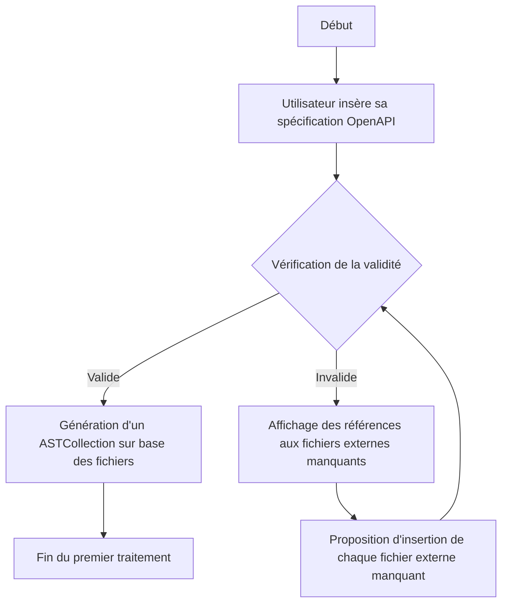

# Processus de génération de code avec OpenAPI-Suite

Ce document présente le flux de travail pour la génération de code automatisée à partir de spécifications OpenAPI. Le logigramme ci-dessous illustre les étapes clés du processus.

## Flux de travail de la génération de code



Le logigramme sera enrichi avec les étapes suivantes du processus de génération.

## Processus de génération basé sur l'ASTCollection

Une fois l'ASTCollection créée à partir des spécifications validées, le processus de génération suivant est appliqué:

```mermaid
flowchart TD
    A[ASTCollection] --> B[Vérification des ASTs contenant des models]
    B --> C{ASTs avec models trouvés?}
    C -->|Oui| D[Pour chaque AST avec models]
    C -->|Non| E[Continuer sans models]
    D --> F[Demander le package à utiliser pour cet AST]
    F --> H[Demander si les models doivent être générés]
    H --> G[Plus d'ASTs à traiter?]
    G -->|Oui| D
    G -->|Non| O[Resolve ASTCollection: remplacer  par les noms de packages]
    O --> E
    E --> I[Demander le type de génération souhaité]
    I --> J{Type sélectionné}
    J -->|Models Only| K[Configuration génération Models]
    J -->|Http Client| L[Configuration génération Http Client]
    J -->|Interoperability Client| M[Configuration génération Interoperability Client]
    J -->|REST Server| N[Configuration génération REST Server]
```

Ce second diagramme détaille le processus de génération qui suit la création initiale de l'ASTCollection.

